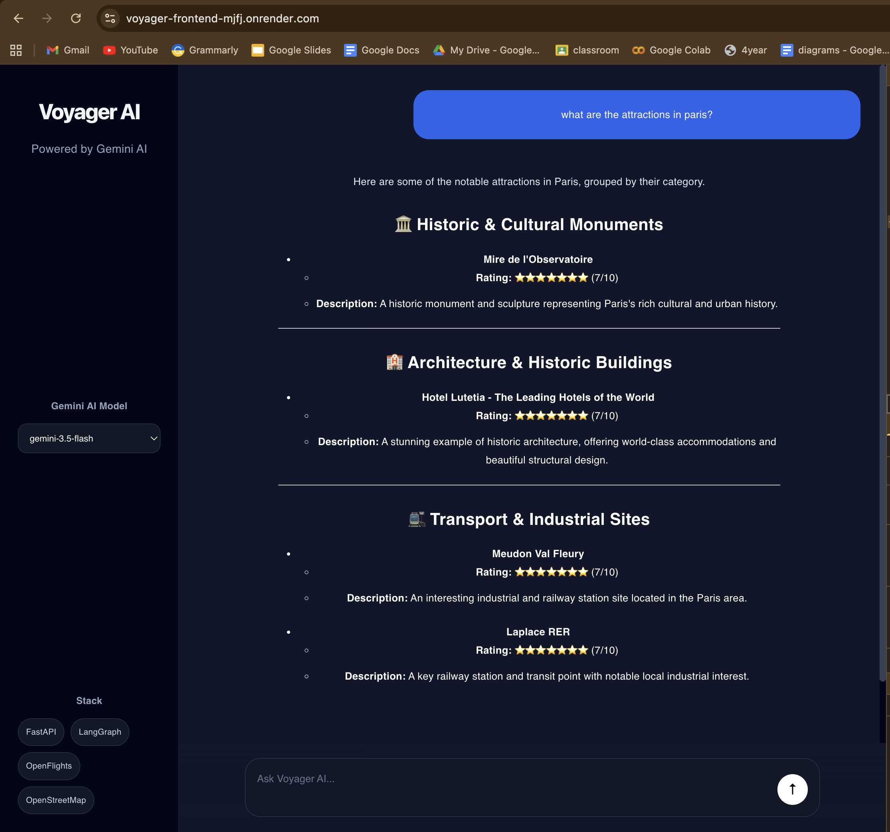
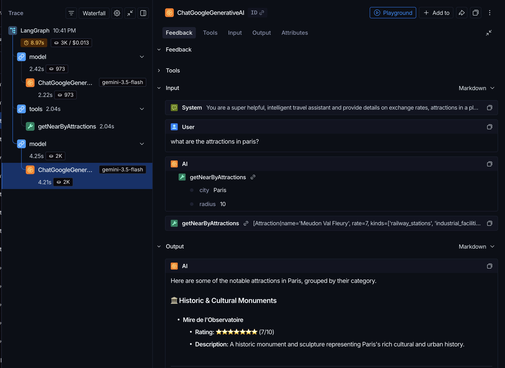

# voyager
Voyager is an AI travel assistent

It uses multiple tools such as currency conversion tool, flights tool, attractions tool to provide you best travel iternary.

Data
* Real time Currency conversion is fetched using exchangerate API
* Flight routes are fetched using static data for this project. The information is stored as csv files in backen/data folder.
* Near by attractions of a city

UI

Langsmith dashboard showing the invocation of attraction tool

